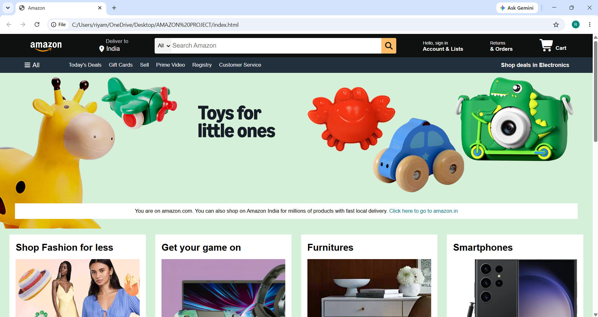
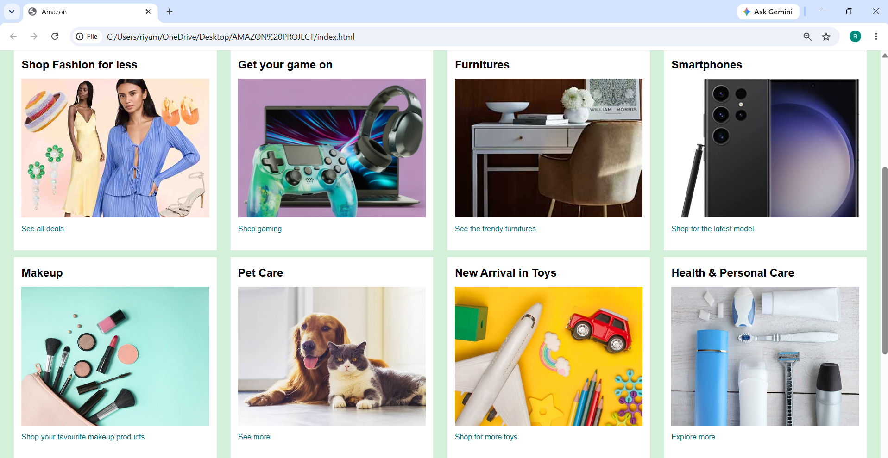
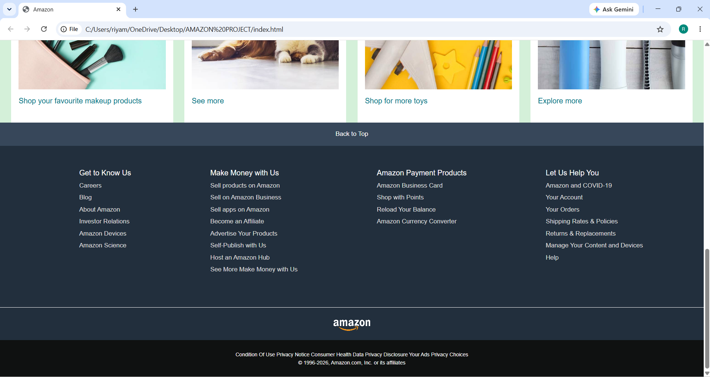

# 🛒 Amazon Clone

A responsive front-end clone of the Amazon homepage built using **HTML5** and **CSS3**. This project replicates the layout and design of Amazon's homepage to strengthen my front-end web development skills.

## 🔗 Live Demo

 (https://riyamishra0226.github.io/AMAZON-PROJECT/)
---

## 📸 Screenshots

### 🏠 Home Page



### 🛍️ Product Section



### 📄 Footer



---

## ✨ Features

- Responsive navigation bar
- Amazon-style logo and search bar
- Hero banner section
- Product category cards
- Shopping sections with images
- Responsive footer
- Clean and organized UI
- Built using only HTML and CSS

---

## 🛠️ Technologies Used

- HTML5
- CSS3

---

## 📂 Project Structure

```
AMAZON-PROJECT/
│── images/
│   ├── amazon_clone_ss1.png
│   ├── amazon_clone_ss2.png
│   └── amazon_clone_ss3.png
│── amazon_logo.png
│── hero_image.jpg
│── box1_image.jpg
│── box2_image.jpg
│── box3_image.jpg
│── box4_image.jpg
│── box5_image.jpg
│── box6_image.jpg
│── box7_image.jpg
│── box8_image.jpg
│── index.html
│── style.css
│── README.md
```

---

## 🚀 Getting Started

1. Clone the repository

```bash
git clone https://github.com/riyamishra0226/AMAZON-PROJECT.git
```

2. Open the project folder.

3. Run the project by opening `index.html` in your browser or using the **Live Server** extension in VS Code.

---

## 🎯 Learning Outcomes

This project helped me improve my understanding of:

- HTML5 semantic structure
- CSS Flexbox
- CSS styling and layouts
- Responsive web design
- Image positioning
- Navigation bar design
- Building real-world website layouts

---

## 🚀 Future Improvements

- Add JavaScript functionality
- Implement product slider
- Add user authentication page
- Create shopping cart functionality
- Improve mobile responsiveness
- Integrate backend using MERN Stack

---

## 👩‍💻 Author

**Riya Mishra**

- GitHub: https://github.com/riyamishra0226

---

## ⭐ Show Your Support

If you like this project, consider giving it a ⭐ on GitHub!
